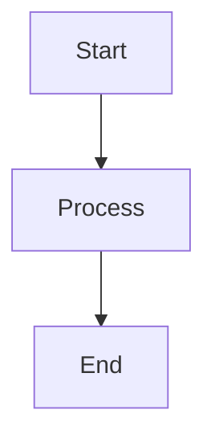

# LiaScript Community Analysis

Research papers and analyses exploring the LiaScript open-source ecosystem — covering adoption patterns, collaboration networks, feature usage, and community structure.

## Subprojects

| Subproject | Type | Focus |
|---|---|---|
| [`DELFI2026_usage_patterns`](papers/DELFI2026_usage_patterns/) | Conference paper | Feature adoption analysis — which LiaScript features are actually used by course creators? |
| [`journal_collaboration`](papers/journal_collaboration/) | Journal paper | Collaboration and content reuse patterns in decentralized OER |
| [`conference_development`](papers/conference_development/) | Conference paper | User segmentation and implications for platform development |
| [`contributor_graph`](papers/contributor_graph/) | Network analysis | Contributor-repository network — are courses isolated or connected through "super users"? |
| [`liascript_course`](papers/liascript_course/) | Interactive course | Data-driven overview of the LiaScript ecosystem |
| [`author_map`](papers/author_map/) | Visualization | Geographic distribution of LiaScript committers (interactive map) |

Shared resources (bibliography, figures, config) are in [`papers/shared/`](papers/shared/).

## Data

The dataset (~3.5 GB) is not included in this repository. It contains crawled LiaScript course data from GitHub (March 2026, 3,672 validated courses).

Download: https://ificloud.xsitepool.tu-freiberg.de/index.php/f/23071124

The data path is configured in [`papers/shared/config.yaml`](papers/shared/config.yaml).

## Quick Start

### Prerequisites Check

```bash
# Verify installations
python3 --version  # Need 3.9+
pandoc --version
xelatex --version
node --version     # For Mermaid diagrams
mmdc --version     # For Mermaid diagrams
```

### Installation

#### 1. System Dependencies

**Ubuntu/Debian:**
```bash
sudo apt install pandoc texlive-xetex texlive-latex-extra chromium-browser
npm install -g @mermaid-js/mermaid-cli
```

**macOS:**
```bash
brew install pandoc node
brew install --cask mactex chromium
npm install -g @mermaid-js/mermaid-cli
```

#### 2. Python Environment

**Option A: Using Pipenv (Recommended)**
```bash
cd /home/sz/Desktop/Python/LiaScript_Paper
pipenv install
pipenv shell
```

**Option B: Virtual Environment**
```bash
cd /home/sz/Desktop/Python/LiaScript_Paper
python3 -m venv venv
source venv/bin/activate  # Windows: venv\Scripts\activate
pip install -r requirements.txt
```

#### 3. Mermaid Diagram Support

The project includes a Pandoc Lua filter for Mermaid diagrams (`paper/filters/mermaid.lua`).

**Test Mermaid installation:**
```bash
mmdc --version

# If "command not found":
npm install -g @mermaid-js/mermaid-cli
```

**Troubleshooting Mermaid:**
- **"mmdc not found"**: Add npm to PATH: `export PATH="$PATH:$(npm bin -g)"`
- **"No usable sandbox"**: Run with `--no-sandbox` flag (handled automatically)
- **"Could not find Chrome"**: `export PUPPETEER_EXECUTABLE_PATH=/usr/bin/chromium`

### Run the Pipeline

```bash
python run_pipeline.py
```

**Output:**
- `paper/build/paper.md` - Markdown version
- `paper/build/paper.tex` - LaTeX version
- `paper/build/paper.pdf` - PDF version
- `mermaid-images/` - Generated diagram images

---

## 📊 Overview

This project provides a complete workflow for:

1. **Data Loading**: Automatically loads and merges LiaScript datasets
2. **Analysis**: Runs comprehensive analyses:
   - Descriptive statistics
   - Feature usage patterns
   - Collaboration networks
   - Temporal trends
   - Topic clustering
   - License compliance
3. **Paper Generation**: Generates documents from Jinja2 templates
4. **Multi-Format Export**: Outputs in Markdown, LaTeX, and PDF with embedded Mermaid diagrams

---

## 📁 Project Structure

```
LiaScript_Paper/
├── config/
│   └── paper_config.yaml          # Main configuration
│
├── data/
│   ├── raw/liascript_data/        # Symlink to LiaScript data
│   └── processed/                 # Analysis caches
│
├── analyses/                      # Analysis modules
│   ├── descriptive_stats.py
│   ├── feature_analysis.py
│   ├── collaboration_analysis.py
│   ├── temporal_analysis.py
│   ├── topic_clustering.py
│   ├── network_analysis.py
│   └── license_analysis.py
│
├── paper/
│   ├── filters/
│   │   └── mermaid.lua           # Pandoc Lua filter for diagrams
│   ├── templates/                # LaTeX templates
│   ├── sections/                 # Jinja2 section templates
│   ├── figures/                  # Generated figures
│   └── build/                    # Generated papers
│
├── pipeline/                     # Core pipeline modules
│   ├── data_loader.py
│   ├── analysis_runner.py
│   └── paper_builder.py
│
├── run_pipeline.py              # Main entry point
└── README.md
```

---

## ⚙️ Configuration

Edit `config/paper_config.yaml` to configure:

```yaml
paper:
  title: "Your Paper Title"
  authors:
    - name: "Author Name"
      affiliation: "Institution"
      email: "email@example.com"

  data:
    base_path: "/path/to/LiaScript/data"

  analyses:
    enabled:
      - descriptive_stats
      - feature_analysis
      - collaboration_analysis
      - temporal_analysis
      - license_analysis

  output:
    format:
      - markdown
      - latex
      - pdf
```

---

## 🔧 Advanced Usage

### Run with Options

```bash
# Use custom config
python run_pipeline.py --config my_config.yaml

# Skip analysis (use cached results)
python run_pipeline.py --skip-analysis

# Analysis only (no paper generation)
python run_pipeline.py --skip-paper

# Debug mode
python run_pipeline.py --log-level DEBUG
```

### Adding New Analyses

1. Create file in `analyses/`:
```python
# analyses/my_analysis.py
def run_analysis(df, config):
    results = {}
    # ... your analysis ...
    return results
```

2. Enable in `config/paper_config.yaml`:
```yaml
analyses:
  enabled:
    - my_analysis
```

3. Create section template in `paper/sections/`:
```markdown
<!-- 05_my_section.md.jinja -->
## My Analysis Results

{{ results.my_analysis.key_finding }}
```

### Embedding Mermaid Diagrams

In any `.md.jinja` template, use standard Mermaid syntax:

````markdown

````

The Lua filter automatically converts them to images during PDF generation.

---

## 📋 Data Requirements

Expected data files in `data/raw/liascript_data/`:

- `LiaScript_files.p` - Main file dataset with license info
- `LiaScript_commits.p` - Commit history
- `LiaScript_metadata.p` - Extracted metadata
- `LiaScript_content.p` - Full text content
- `LiaScript_ai_meta.p` - AI-generated metadata
- `LiaScript_repositories.p` - Repository info

---

## 🔬 Research Questions

The pipeline addresses five main research questions:

**RQ1:** How widespread is LiaScript adoption in the international education community?

**RQ2:** What characterizes LiaScript content in terms of structure and features?

**RQ3:** What collaboration patterns exist in LiaScript course development?

**RQ4:** What lifecycle and sustainability patterns emerge?

**RQ5:** How open are LiaScript materials in terms of licensing?

See `config/paper_config.yaml` for detailed sub-questions.

---

## 🐛 Troubleshooting

### Pandoc Errors

**Pandoc not found:**
```bash
# Ubuntu/Debian
sudo apt install pandoc

# macOS
brew install pandoc
```

**XeLaTeX errors:**
```bash
# Install full TeX distribution
sudo apt install texlive-full  # Ubuntu
brew install --cask mactex      # macOS
```

### Mermaid Diagram Errors

**Filter errors:**
- Ensure `mmdc` is installed: `npm install -g @mermaid-js/mermaid-cli`
- Check Lua filter exists: `ls paper/filters/mermaid.lua`

**Image generation fails:**
- Install Chromium: `sudo apt-get install chromium-browser`
- Set browser path: `export PUPPETEER_EXECUTABLE_PATH=/usr/bin/chromium`

### Missing Data Files

**Verify symlink:**
```bash
ls -la data/raw/liascript_data/
# Should point to: /media/sz/Data/Connected_Lecturers/LiaScript/raw
```

**Fix broken symlink:**
```bash
rm data/raw/liascript_data
ln -s /path/to/actual/data data/raw/liascript_data
```

### Module Import Errors

```bash
# Ensure correct directory and environment
cd LiaScript_Paper
source venv/bin/activate  # or: pipenv shell
python run_pipeline.py
```

---

## 🧪 Development

### Exploratory Analysis

Use Jupyter notebooks:

```bash
jupyter notebook notebooks/
```

```python
from pipeline.data_loader import LiaScriptDataLoader

loader = LiaScriptDataLoader("/path/to/data")
df = loader.load_all()
df.head()
```

### Running Tests

```bash
pytest tests/
```

---

## 📄 Output Validation

After running the pipeline, verify:

```bash
# Check PDF was generated
ls -lh paper/build/paper.pdf

# Verify reasonable file size (1-2 MB, not 50KB!)
du -h paper/build/paper.pdf

# Check images were embedded
pdfimages -list paper/build/paper.pdf

# View the PDF
xdg-open paper/build/paper.pdf  # Linux
open paper/build/paper.pdf      # macOS
```

---

## 📝 License

[Specify license]

## 👥 Contact

[Your contact information]

## 📖 Citation

If you use this pipeline in your research, please cite:

```
[Citation information to be added]
```

## 🙏 Acknowledgments

- Built on data from the LiaScript Community Analysis project
- Mermaid diagram support via Pandoc Lua filter
- Pipeline framework inspired by reproducible research best practices
